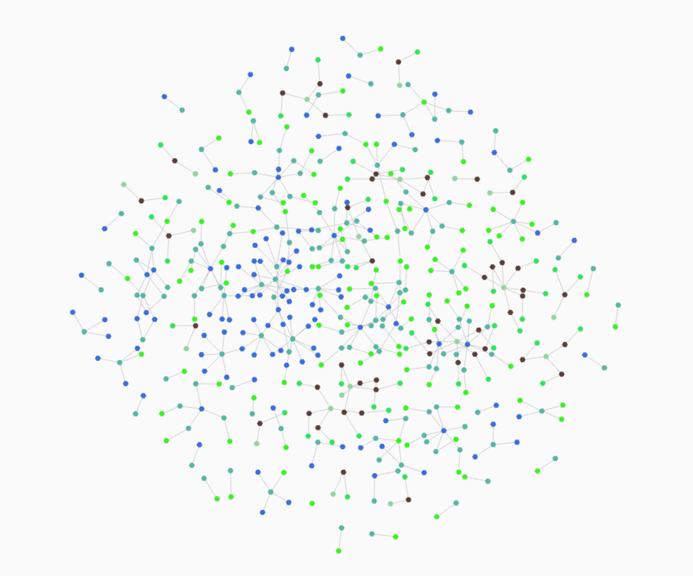

# cluster

# Example output



# Development
```bash
# Open a terminal and run
npm install
npm run build:dev
# Open another terminal and run
npm run start:dev

# Open localhost:3000 in a browser
```
If you want to develop with simple-gl
```
cd ..
git clone https://github.com/chrisbarbour/simple-gl.git
cd cluster
npm link ../simple-gl
```